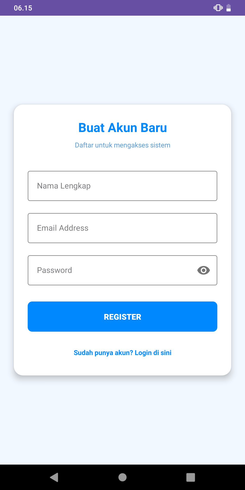
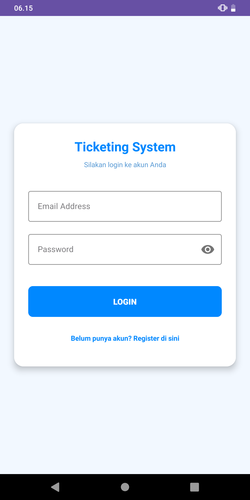
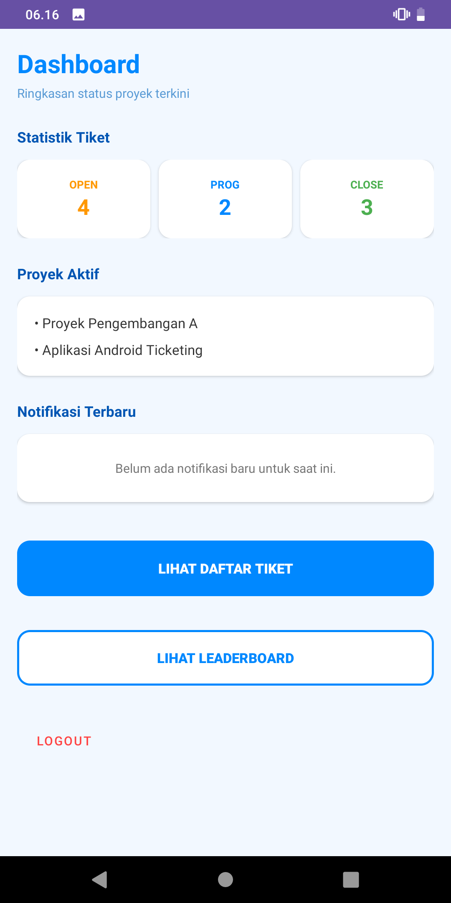
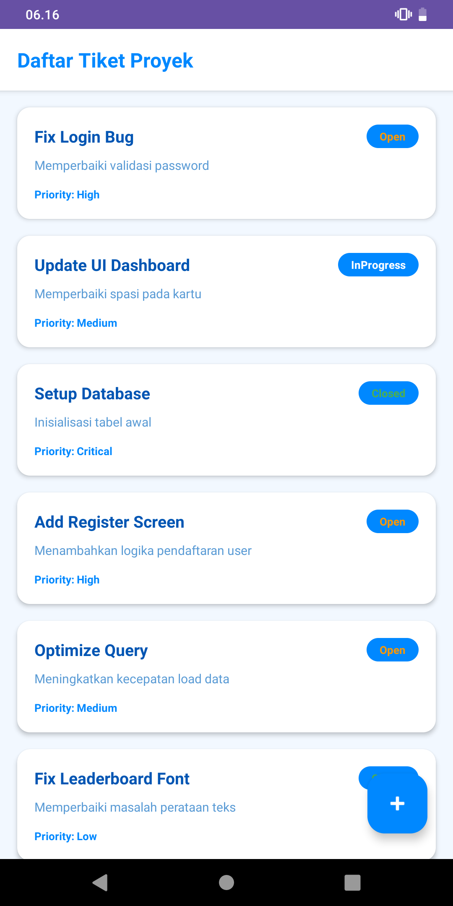
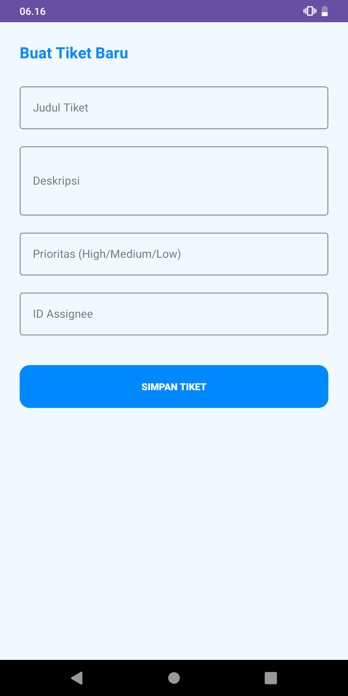
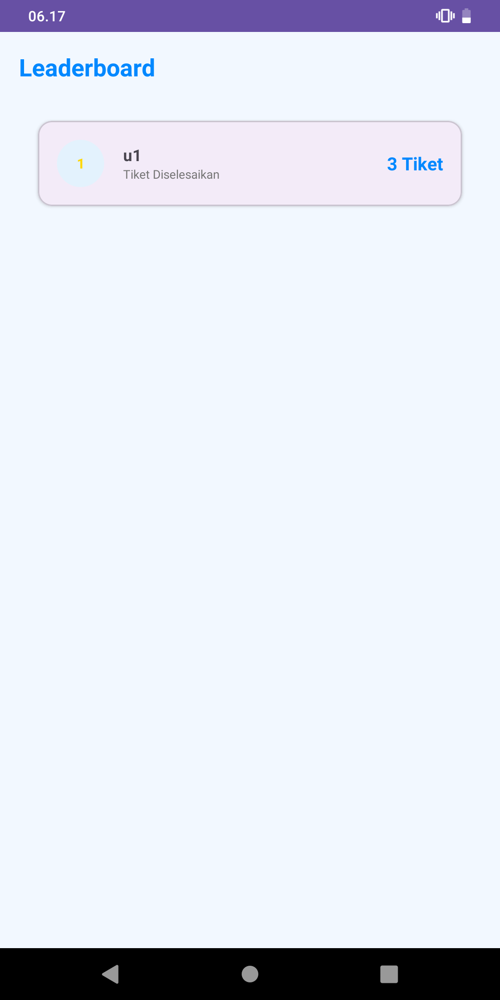

# Kelompok 2 - Aplikasi Ticketing Management

Sebuah aplikasi berbasis Android Native yang dikembangkan untuk memenuhi tugas mata kuliah Pemrograman Mobile 1 di Universitas Teknologi Bandung (UTB). Aplikasi ini dirancang untuk mengelola tiket bantuan/laporan teknis secara efisien, mulai dari proses pembuatan tiket, pelacakan status, hingga analitik kinerja anggota tim melalui fitur leaderboard.
---

## 👥 Tim Pengembang (Kelompok 4)

| Nama Lengkap | NPM | Peran dalam Proyek |
| :--- | :--- | :--- |
| [nama] | [nim] | [role] |
| [nama] | [nim] | [role] |
| [nama] | [nim] | [role] |

---

## 🎥 Video Penjelasan Proyek

🔗 **[https://youtu.be/](https://youtu.be/)**

---

## 📱 Tangkapan Layar Aplikasi (Screenshots)

  
  &nbsp;&nbsp;&nbsp;&nbsp;
  
  &nbsp;&nbsp;&nbsp;&nbsp;
  
  
  
  

---

## ⚙️ Ringkasan Fitur

(Autentikasi User): Sistem Login dan Registrasi pengguna untuk menjaga keamanan data akses ke dalam aplikasi.
(Dashboard Statistik): Dasbor interaktif yang menampilkan ringkasan status tiket (Open, In Progress, Closed) secara real-time untuk memantau beban kerja.
(Manajemen Tiket - CRUD): Fitur lengkap untuk membuat (Create), membaca (Read), mengubah (Update), dan menghapus (Delete) tiket dukungan dengan berbagai tingkat prioritas (Critical, High, Medium, Low).
(Leaderboard & Analitik): Sistem peringkat otomatis yang menghitung jumlah tiket yang berhasil diselesaikan oleh setiap pengguna, memotivasi produktivitas tim.
(Persistence Data): Penyimpanan data lokal yang efisien menggunakan database SQLite untuk memastikan data tetap tersimpan meski aplikasi ditutup.

---

## 🚀 Cara Menjalankan (Cloning) Proyek

Proyek ini dibangun menggunakan **Kotlin** dan dioptimalkan untuk **Android Studio** dengan basis data lokal **SQLite**.

### Cara Cloning Proyek:
1. Buka CMD (Command Prompt) atau Terminal dan masuk ke folder yang akan menjadi tempat clone.
2. Salin link repository GitHub proyek ini.
3. Pada CMD, ketik perintah clone dengan cara: `git clone [tempel_link_github_disini]`
4. Lalu ketik: `cd projek-programmobile-kelompok2`
5. Pada CMD ketik `git checkout main`, karena versi final aplikasi berada di branch main.

### Cara Menjalankan di Android Studio:
1. Pada Android Studio, klik menu **File** di pojok kiri atas.
2. Lalu pilih **Open**.
3. Pilih folder yang tadi menjadi tempat cloning proyek.
5. Lalu pilih folder **app**.
4. Lalu tunggu hingga proses sinkronisasi Gradle selesai di latar belakang.
5. Jika Gradle sudah selesai, lakukan *running* aplikasi dengan cara mengaktifkan emulator (AVD) atau menyambungkan HP fisik.
6. Lalu klik tombol **Play (Run)** berwarna hijau di bagian atas menu Android Studio.

### Cara Menggunakan Aplikasi:
Registrasi: Daftar akun baru pada halaman Login/Registrasi.
Login: Masuk menggunakan email dan password yang telah didaftarkan.
Dashboard: Setelah Login, Anda akan masuk ke Dashboard yang menampilkan jumlah tiket berdasarkan status.
Kelola Tiket:
Gunakan tombol BUAT TIKET BARU untuk menambah laporan.
Gunakan menu LIHAT SEMUA TIKET untuk melihat daftar, mengedit, atau menghapus tiket.
Leaderboard: Klik tombol LIHAT LEADERBOARD untuk melihat siapa anggota tim yang paling banyak menyelesaikan tiket.
Logout: Gunakan tombol Logout di pojok kanan atas Dashboard untuk mengakhiri sesi dan kembali ke halaman Login.
